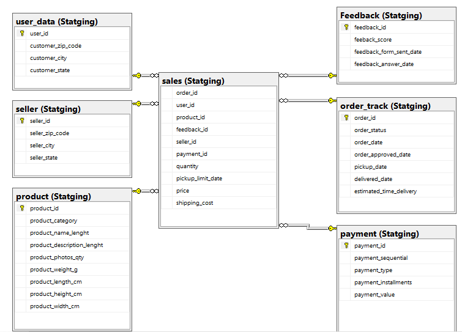
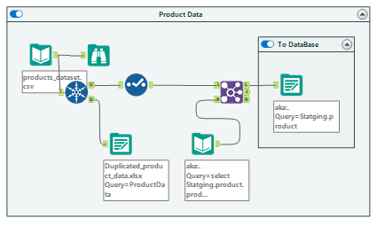
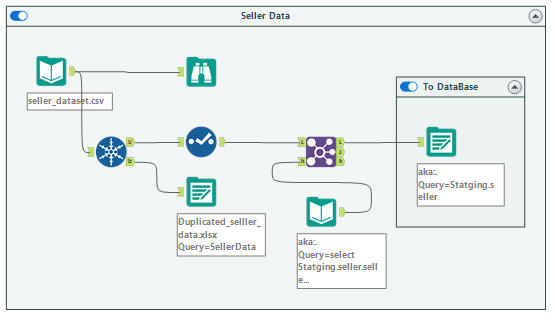
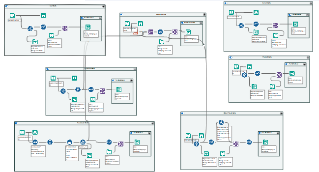

# Staging Layer README

## Overview

The Staging Layer is a critical step in the data engineering process, where raw data from CSV files is ingested into a SQL Server database using Alteryx. This layer serves as an intermediate step, facilitating minimal transformations and ensuring data integrity before it progresses to the Data Warehouse.

## Schema Design



### Feedback Table

```sql
-- Feedback Table Schema
Drop Table Statging.Feedback
Create Table Statging.Feedback (
  feedback_id varchar(254) primary key,
  feeback_score int ,
  feedback_form_sent_date Date,
  feedback_answer_date Date
)
```


The "Feedback" table captures feedback details with minimal transformation, preserving primary keys.

### Order Track Table

```sql
-- Order Track Table Schema
Drop Table Statging.order_track
Create Table Statging.order_track(
  order_id varchar(254) primary key,
  order_status varchar(254) ,
  order_date dateTime,
  order_approved_date dateTime,
  pickup_date dateTime,
  delivered_date dateTime,
  estimated_time_delivery dateTime
)
```

The "Order Track" table maintains order details, including status and timestamps.


### Payment Table

```sql
-- Payment Table Schema
Drop Table Statging.payment
Create Table Statging.payment (
  payment_id int primary key,
  payment_sequential int,
  payment_type varchar(254),
  payment_installments int,
  payment_value float 
)
```

The "Payment" table records payment details with minimal transformation, ensuring data consistency.


### Product Table

```sql
-- Product Table Schema
Drop Table Statging.product
Create Table Statging.product (
  product_id varchar(254) primary key,
  product_category varchar(254) ,
  product_name_lenght int,
  product_description_lenght int,
  product_photos_qty int,
  product_weight_g int,
  product_length_cm int ,
  product_height_cm int,
  product_width_cm int
)
```

The "Product" table holds product information, maintaining the integrity of primary keys.



### Seller Table

```sql
-- Seller Table Schema
Drop Table Statging.seller
Create Table Statging.seller(
  seller_id varchar(254) primary key,
  seller_zip_code int ,
  seller_city varchar(254),
  seller_state varchar(254)
)
```

The "Seller" table captures seller details with minimal transformation.



### User Data Table

```sql
-- User Data Table Schema
Drop Table Statging.user_data
Create Table Statging.user_data (
  user_id varchar(254) primary key,
  customer_zip_code int,
  customer_city varchar(254),
  customer_state varchar(254)
)
```

The "User Data" table holds user information, and the data is truncated for a clean slate before ingestion.


### Sales Table

```sql
-- Sales Table Schema
Drop Table Statging.sales
Create Table Statging.sales (
  order_id varchar(254) ,
  user_id varchar(254) ,
  product_id varchar(254) ,
  feedback_id varchar(254),
  seller_id varchar(254),
  payment_id int,
  quantity int ,
  pickup_limit_date timestamp,
  price float,
  shipping_cost float,
  FOREIGN KEY (order_id) REFERENCES Statging.order_track(order_id),
  FOREIGN KEY (user_id) REFERENCES Statging.user_data(user_id),
  FOREIGN KEY (product_id) REFERENCES Statging.product(product_id),
  FOREIGN KEY (feedback_id) REFERENCES Statging.feedback(feedback_id),
  FOREIGN KEY (payment_id) REFERENCES Statging.payment(payment_id),
  FOREIGN KEY (seller_id) REFERENCES Statging.seller(seller_id),
)
```

The "Sales" table consolidates data from various sources, linking to relevant tables through foreign keys.


## Alteryx Workflow

For each source table, an Alteryx workflow is created to facilitate the movement of data into the Staging Layer. The workflow ensures data consistency and integrity during the extraction and loading process.




