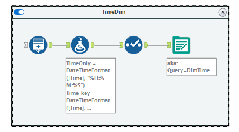
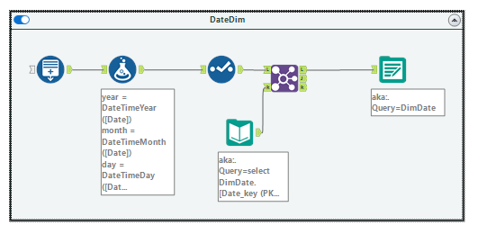
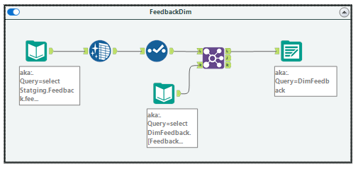
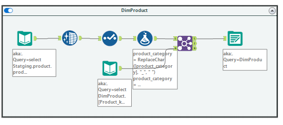
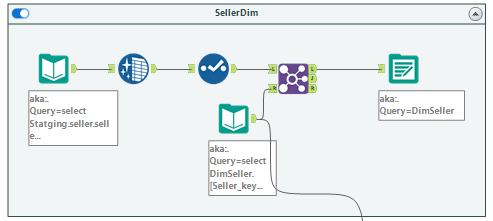
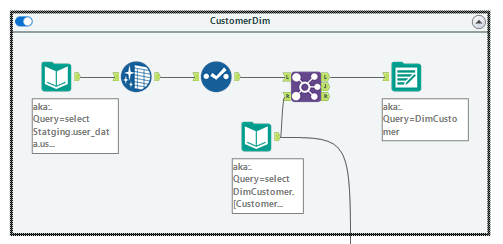
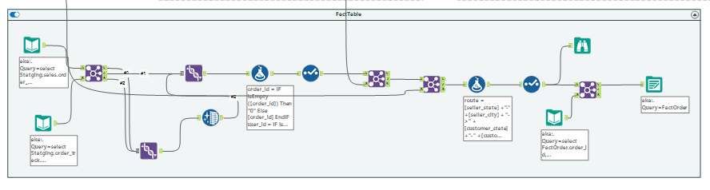
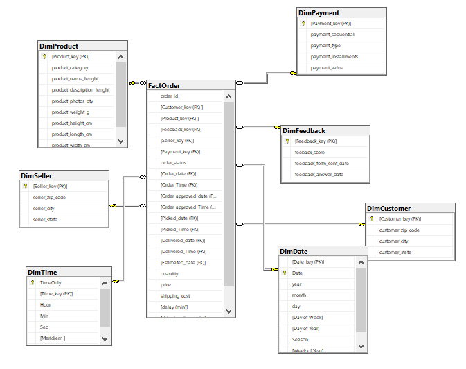

# Data Warehouse Design README

## Overview

The Data Warehouse Design involves the creation of dimension and fact tables to facilitate efficient and meaningful data analysis. In this process, we've designed dimension tables to capture essential attributes like time, date, product, seller, payment, and customer. Additionally, we've created a fact table, "FactOrder," to consolidate information from orders and related entities.

## Dimension Tables

### DimTime


generate a table with 24 hours and add new records only if they don't already exist.

```sql
CREATE TABLE [dbo].[DimTime](
	[TimeOnly] [char](8) NOT NULL,
	[Time_key (PK)] [bigint] NOT NULL,
	[Hour] [int] NULL,
	[Min] [int] NULL,
	[Sec] [int] NULL,
	[Meridiem ] [varchar](max) NULL,
	[Time of Day] [varchar](max) NULL,
	CONSTRAINT [PK_DimTime] PRIMARY KEY CLUSTERED 
	(
		[TimeOnly] ASC
	) ON [PRIMARY]
) ON [PRIMARY] TEXTIMAGE_ON [PRIMARY]
```

The "DimTime" table captures time-related attributes with granularity down to seconds.

### DimDate

generate a table form 2016-01-01 to today + 2 days and add new records only if they don't already exist.

```sql
CREATE TABLE [dbo].[DimDate](
	[Date_key (PK)] [bigint] NOT NULL,
	[Date] [date] NOT NULL,
	[year] [int] NULL,
	[month] [int] NULL,
	[day] [int] NULL,
	[Day of Week] [int] NULL,
	[Day of Year] [int] NULL,
	[Season] [nvarchar](max) NULL,
	[Week of Year] [int] NULL,
	CONSTRAINT [PK_DimDate_1] PRIMARY KEY CLUSTERED 
	(
		[Date] ASC
	) ON [PRIMARY]
) ON [PRIMARY] TEXTIMAGE_ON [PRIMARY]
```

The "DimDate" table provides a comprehensive date dimension with attributes such as year, month, day, day of the week, and more.

### DimFeedback

Cleaned and structured feedback data is captured in the "DimFeedback" table through a series of transformations and add new records only if they don't already exist.

```sql
CREATE TABLE [dbo].[DimFeedback](
	[Feedback_key (PK)] [varchar](254) NOT NULL,
	[feedback_score] [int] NULL,
	[feedback_form_sent_date] [date] NULL,
	[feedback_answer_date] [date] NULL,
	PRIMARY KEY CLUSTERED 
	(
		[Feedback_key] ASC
	) ON [PRIMARY]
) ON [PRIMARY]
```

The "DimFeedback" table captures cleaned and structured feedback data.

### DimProduct

Cleaned and structured product data is captured in the "DimProduct" table through a series of transformations and add new records only if they don't already exist.

```sql
CREATE TABLE [dbo].[DimProduct](
	[Product_key (PK)] [varchar](254) NOT NULL,
	[product_category] [varchar](254) NULL,
	[product_name_lenght] [int] NULL,
	[product_description_lenght] [int] NULL,
	[product_photos_qty] [int] NULL,
	[product_weight_g] [int] NULL,
	[product_height_cm] [int] NULL,
	[product_length_cm] [int] NULL,
	[product_width_cm] [int] NULL,
	CONSTRAINT [PK_DimProduct] PRIMARY KEY CLUSTERED 
	(
		[Product_key] ASC
	) ON [PRIMARY]
) ON [PRIMARY]
```

The "DimProduct" table captures cleaned and structured product data.

### DimSeller

Cleaned and structured seller data is captured in the "DimSeller" table through a series of transformations and add new records only if they don't already exist.

```sql
CREATE TABLE [dbo].[DimSeller](
	[Seller_key (PK)] [varchar](254) NOT NULL,
	[seller_zip_code] [int] NULL,
	[seller_city] [varchar](254) NULL,
	[seller_state] [varchar](254) NULL,
	CONSTRAINT [PK_DimSeller] PRIMARY KEY CLUSTERED 
	(
		[Seller_key] ASC
	) ON [PRIMARY]
) ON [PRIMARY]
```

The "DimSeller" table captures cleaned and structured seller data.

### DimPayment

Cleaned and structured payment data is captured in the "DimPayment" table through a series of transformations and add new records only if they don't already exist.

```sql
CREATE TABLE [dbo].[DimPayment](
	[Payment_key (PK)] [int] NOT NULL,
	[payment_sequential] [int] NULL,
	[payment_type] [varchar](254) NULL,
	[payment_installments] [int] NULL,
	[payment_value] [float] NULL,
	CONSTRAINT [PK_DimPayment] PRIMARY KEY CLUSTERED 
	(
		[Payment_key] ASC
	) ON [PRIMARY]
) ON [PRIMARY]
```

The "DimPayment" table captures cleaned and structured payment data.

### DimCustomer

Cleaned and structured customer data is captured in the "DimCustomer" table through a series of transformations and add new records only if they don't already exist.

```sql
CREATE TABLE [dbo].[DimCustomer](
	[Customer_key (PK)] [varchar](254) NOT NULL,
	[customer_zip_code] [int] NULL,
	[customer_city] [varchar](254) NULL,
	[customer_state] [varchar](254) NULL,
	CONSTRAINT [PK_DimCustomer] PRIMARY KEY CLUSTERED 
	(
		[Customer_key] ASC
	) ON [PRIMARY]
) ON [PRIMARY]
```

The "DimCustomer" table captures cleaned and structured customer data.

## Fact Table

### FactOrder

Joining the "Order" table with the "Order Item" table, we've created a staging table, "FactOrder," to consolidate information from orders and related entities.


```sql
CREATE TABLE [dbo].[FactOrder](
	[order_id] [varchar](254) NULL,
	[Customer_key (FK) ] [varchar](254) NULL,
	[Product_key (FK) ] [varchar](254) NULL,
	[Feedback_key (FK)] [varchar](254) NULL,
	[Seller_key (FK)] [varchar](254) NULL,
	[Payment_key (FK)] [int] NULL,
	[order_status] [varchar](254) NULL,
	[Order_date (FK)] [date] NULL,
	[Order_Time (FK)] [char](8) NOT NULL,
	[Order_approved_date (FK)] [date] NULL,
	[Order_approved_Time (FK)] [char](8) NULL,
	[Picked_date (FK)] [date] NULL,
	[Picked_Time (FK)] [char](8) NULL,
	[Delivered_date (FK)] [date] NULL,
	[Delivered_Time (FK)] [char](8) NULL,
	[Estimated_date (FK)] [date] NULL,
	[quantity] [int] NULL,
	[price] [float] NULL,
	[shipping_cost] [float] NULL,
	[delay (min)] [bigint] NULL,
	[shipping_time (min)] [bigint] NULL,
	[route] [nvarchar](max) NULL
) ON [PRIMARY] TEXTIMAGE_ON [PRIMARY]
```

The "FactOrder" table consolidates information from orders and related entities, linking to dimension tables through foreign keys.

## Data Model

