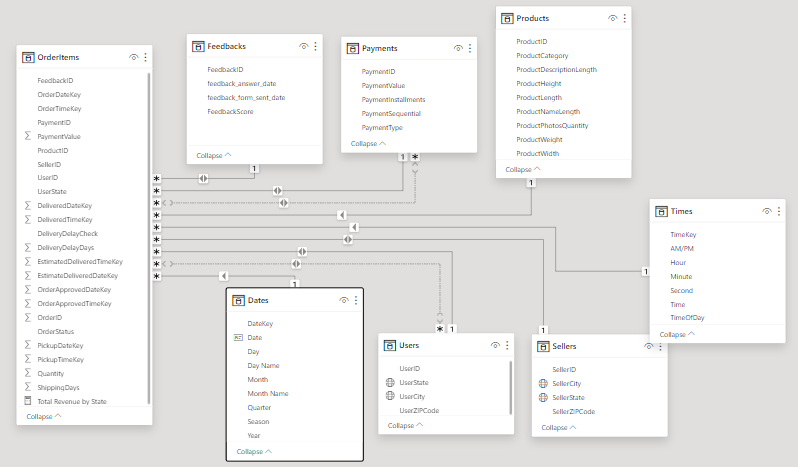

# Data Warehouse Design - README

This README provides an overview of the Power Query transformations applied to each dimension table during the data warehouse design process.

## Date Table

### Transformation Steps
1. **Promotion of Headers:** Header information is promoted to the table's column headers.
2. **Type Conversion:** The "Date" column is converted to a date data type.

## Feedback Table

### Transformation Steps
1. **Promotion of Headers:** Header information is promoted to the table's column headers.
2. **Type Conversion:** Columns such as "FeedbackID" and "FeedbackScore" are converted to the appropriate data types.

## Payments Table

### Transformation Steps
1. **Promotion of Headers:** Header information is promoted to the table's column headers.
2. **Type Conversion:** Columns like "PaymentID" and "PaymentSequential" are converted to the correct data types.
3. **Text Capitalization:** The "PaymentType" column is capitalized for consistency.
4. **Value Replacement:** Underscores in "PaymentType" are replaced with spaces.

## Products Table

### Transformation Steps
1. **Promotion of Headers:** Header information is promoted to the table's column headers.
2. **Type Conversion:** Columns like "ProductID" and "ProductCategory" are converted to the correct data types.

## Sellers Table

### Transformation Steps
1. **Promotion of Headers:** Header information is promoted to the table's column headers.
2. **Type Conversion:** Columns like "SellerID" and "SellerZIPCode" are converted to the correct data types.
3. **Text Capitalization:** "SellerCity" and "SellerState" columns are capitalized for consistency.

## Times Table

### Transformation Steps
1. **Promotion of Headers:** Header information is promoted to the table's column headers.
2. **Type Conversion:** Columns like "TimeKey" and "Time" are converted to the correct data types.

## Users Table

### Transformation Steps
1. **Promotion of Headers:** Header information is promoted to the table's column headers.
2. **Type Conversion:** Columns like "UserZIPCode" and "UserID" are converted to the correct data types.
3. **Text Capitalization:** "UserCity" and "UserState" columns are capitalized for consistency.

## Orders Table

### Transformation Steps
1. **Promotion of Headers:** Header information is promoted to the table's column headers.
2. **Type Conversion:** Various columns are converted to the correct data types.
3. **Joining:** The table is joined with other dimension tables like "Payments" and "Users" based on common keys.

