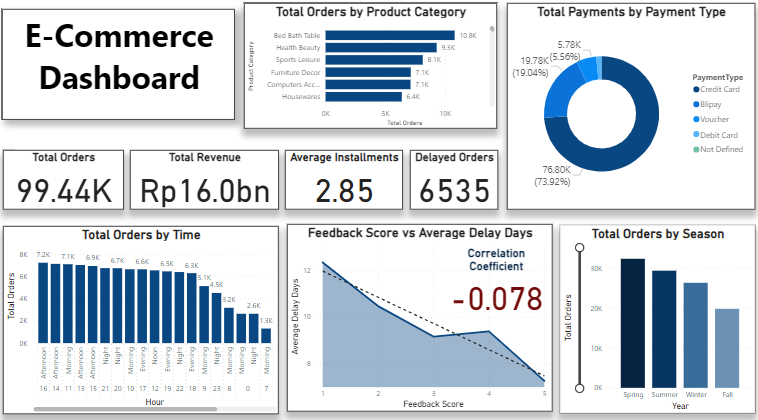
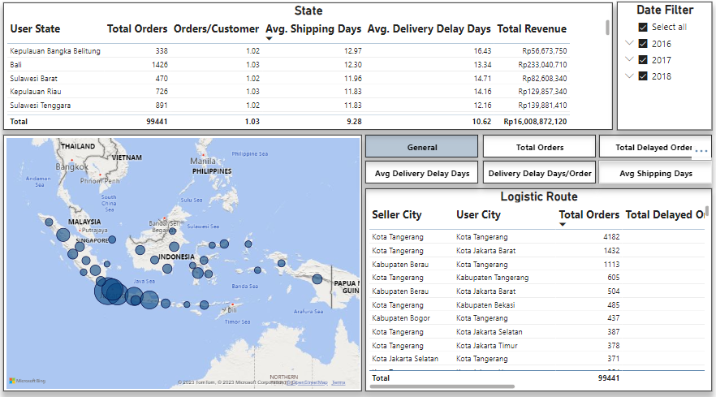
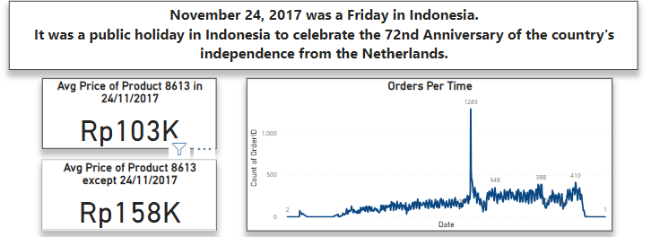
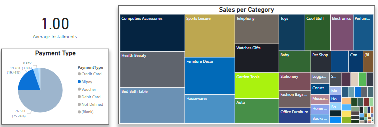

# Final insights from the analysis
## Overview

In the culmination of this data engineering project, we present insightful visualizations derived from Power BI, offering a comprehensive overview of key metrics and patterns within the e-commerce dataset.

# Page one

### Key Metrics

- **Total Orders:**
  - Distinct number of orders: 99.44 K

- **Total Revenue:**
  - Total payment value: 16.0 bn

- **Average Installments:**
  - AVERAGEX function calculates the average number of installments, yielding 2.85 on average.

- **Total Payments:**
  - Calculated by counting the distinct payment IDs, providing a holistic view of payment transactions.

### Payment Distribution

- **Credit Card:**
  - Percentage of total payments: 73.92%

- **Bilpay:**
  - Percentage of total payments: 19.04%

- **Voucher:**
  - Percentage of total payments: 5.54%

### Order Distribution by Time

- **Peak Order Times:**
  - 16:00 (Afternoon) with 7249 orders
  - 14:00 (Afternoon) with 7139 orders

### Correlation Analysis

- **Correlation between Feedback Score and Delivery Delay:**
  - Correlation coefficient: -0.078
  - Indicates a weak negative correlation between feedback score and delivery delay.

### Seasonal Trends

- **Total Orders by Season:**
  - Spring exhibits the highest order volume with 32,353 orders.

# Page two

### Key Metrics

    - **Worst Traffic by city:**
      - Between Kabupaten Tangerang and Kabupaten Bintan with 181 days of delay.

    - **Worst Traffic by State:**
        - Bengkulu with 20.27 days of delay.

# more insights

- We can see that in 24/11/2017 there is a huge spike in sales, which is 1.5 times the average sales.
This is due to the Black Friday sales. and we can see that the sales are increasing in the next few days.
This is also the 74 anniversary in indonesia, which is a national holiday.

- We can see that the most used payment method is credit card, which is 73.92% of the total payments.
- The second most used payment method is Bilpay, which is 19.04% of the total payments.
But we can see that the average payment value of Bilpay is higher than the average payment value of credit card. 
For Blipay the most category of products that are bought is Computer Accessories, and for credit card the most category of products that are bought is Health and Beauty.

## Conclusion

This Power BI dashboard provides a visually engaging representation of key e-commerce metrics, enabling stakeholders to make informed decisions. The insights gained from this analysis encompass order distribution, payment trends, and correlations, offering a holistic understanding of the dataset's dynamics. The weak negative correlation between feedback score and delivery delay suggests an area for improvement in customer satisfaction. As the e-commerce industry continues to evolve, these insights will contribute to strategic decision-making and process optimization.