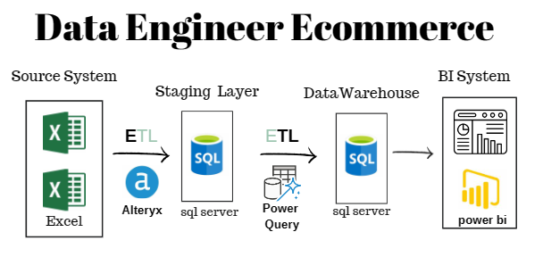

# Data Engineering for E-commerce: An End-to-End Project

## Project Description

Welcome to our comprehensive end-to-end data engineering project tailored for e-commerce. In this project, We have meticulously crafted a streamlined data pipeline to handle diverse datasets from various sources. The journey involves extracting data from CSV files, utilizing Alteryx for minimal transformations, transferring it to SQL Server for staging, and further refining it with Power Query transformations. Finally, we delve into SQL Server for data modeling and leverage Power BI for insightful analysis.



### Key Components:

#### ETL Workflow with Alteryx:
Explore the Alteryx workflow that efficiently extracts data from CSV files and loads it into SQL Server with minimal transformations, ensuring a smooth transition from source to the staging area.

#### Power Query Transformations:
Witness the power of Power Query as it refines and transforms data within the SQL Server staging area, ensuring data quality and integrity before proceeding to the modeling phase.

#### Data Modeling in SQL Server:
Delve into the intricacies of data modeling, where the structure of the data warehouse, including dimension and fact tables, is meticulously crafted for analytical purposes.

#### SQL Analysis for Strategic Insights:
Experience the synergy of SQL Server and Power BI as We leverage queries to uncover valuable insights, enabling informed decision-making in the dynamic e-commerce landscape.

### Project Highlights:

- **Efficient ETL Process:** Alteryx facilitates a seamless transition from CSV to SQL Server, ensuring data integrity with minimal transformations.

- **Robust Power Query Transformations:** The Power Query component enhances data quality during the staging process, preparing it for comprehensive analysis.

- **Scalable Data Modeling:** The architecture is designed to handle growing datasets and evolving business requirements during the modeling phase.

- **Actionable Intelligence:** The analysis phase, powered by SQL Server and visualized through Power BI, provides strategic insights to drive informed business decisions.

## [1. Source Data](./1.%20Source%20Data/README.md)

Data Source:


## [2. Staging layer](./2.%20Staging%20layer/README.md)

Staging Model:


Alteryx Workflow:


## [3. Data Warehouse](./3.%20DataWarehouse%20Design/README.md)

Data Warehouse Model:


## [4. Analysis using SQL](./4.%20Analysis%20The%20Data/README.md)

Example of the analysis:
Question: 

Which Logistic Route Has Heavy Traffic In Our E-Commerce? (Delay Frequency)

```sql
SELECT TOP 10 CONCAT(Sellers.SellerState, ', ', Sellers.SellerCity,' ==>> ', Users.UserState, ', ', Users.UserCity) 'Logistic Route', AVG(SubQuery.MaxDeliveryDelayDays) / 
           COUNT(DISTINCT(OrderItems.OrderID)) AS 'Average Delivery Days Per Order'
FROM (
    SELECT OrderItems.OrderID, MAX(OrderItems.DeliveryDelayDays*1.0) AS MaxDeliveryDelayDays
    FROM OrderItems
	WHERE OrderItems.DeliveryDelayCheck = 'Delayed'
    GROUP BY OrderItems.OrderID
) AS SubQuery
JOIN OrderItems ON SubQuery.OrderID = OrderItems.OrderID
JOIN Users
ON Users.UserID = OrderItems.UserID
JOIN Sellers
ON Sellers.SellerID = OrderItems.SellerID
WHERE OrderItems.DeliveryDelayCheck = 'Delayed'
GROUP BY Sellers.SellerState, Sellers.SellerCity, Users.UserState, Users.UserCity
ORDER BY 'Average Delivery Days Per Order' DESC;
```

## [5. Final Insights](./5.%20Final%20Insights/README.md)

Main KPIs:


Location KPIs:


## Project Presentation

https://www.canva.com/design/DAF4b_QR4-0/cxoS4bgAY-N73LIUHhu6zw/edit?utm_content=DAF4b_QR4-0&utm_campaign=designshare&utm_medium=link2&utm_source=sharebutton


### Conclusion:

This project showcases the integration of Alteryx for efficient ETL processes, Power Query for meticulous transformations, and SQL Server along with Power BI for insightful analysis. Join me in exploring the intricacies of data engineering, from CSV extraction to strategic insights in the context of an ever-evolving e-commerce industry.